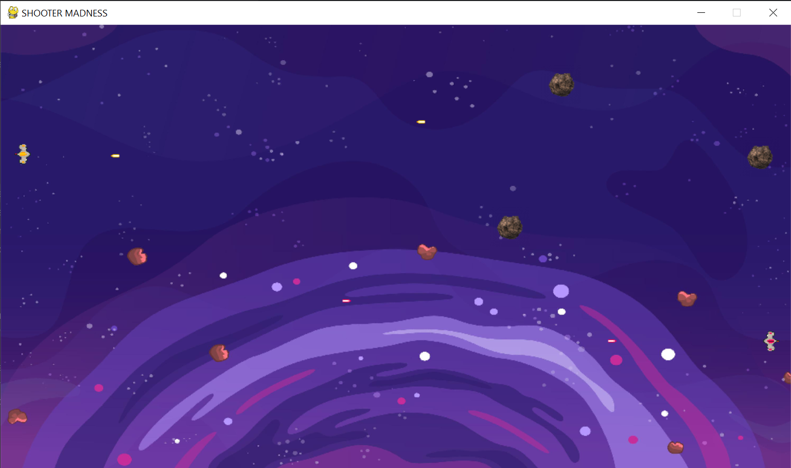
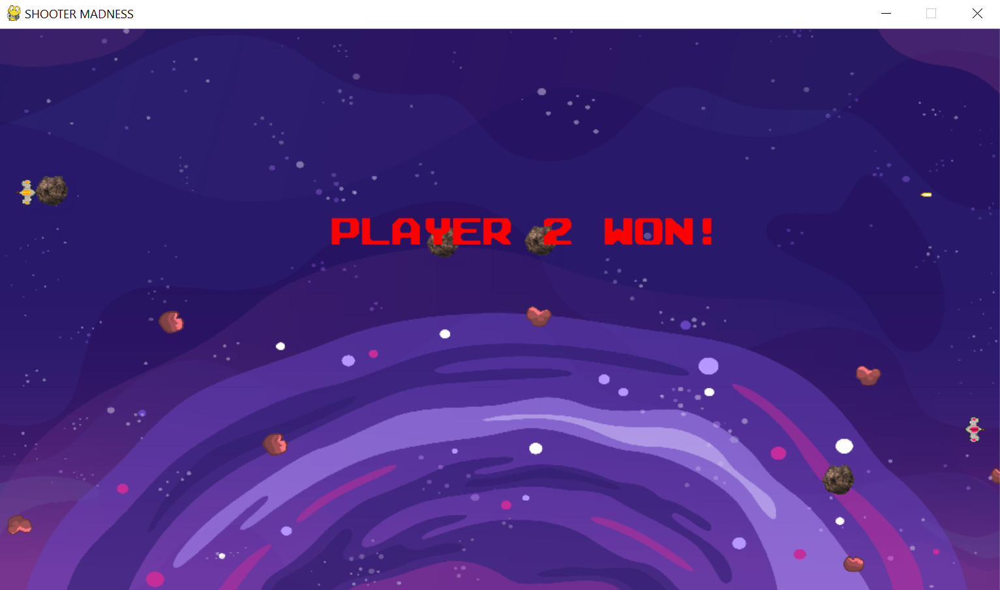
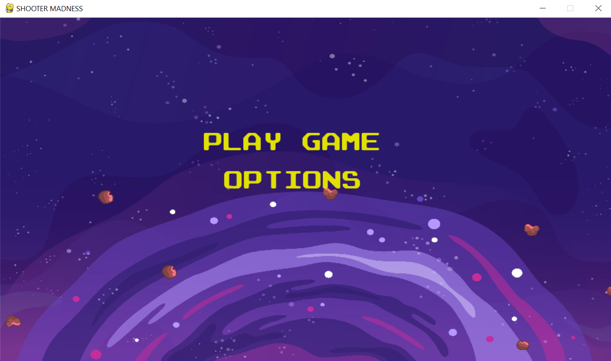

# Shooter Madness

Shooter Madness is an exciting 2D space shooter game built using Python and the Pygame library. Players control spaceships and compete against each other in an epic battle against meteors and each other, using various power-ups to enhance their gameplay.





## Table of Contents

- [Features](#features)
- [Installation](#installation)
- [Usage](#usage)
- [Game Controls](#game-controls)
- [Assets](#assets)
- [License](#license)
- [Acknowledgments](#acknowledgments)

## Features

- **Two-player mode**: Play against a friend in a local multiplayer setting.
- **Dynamic gameplay**: Avoid meteors and shoot your opponent while collecting power-ups.
- **Interactive menu**: Start the game or access options through a main menu.
- **Sound effects**: Enjoy immersive sounds and background music during gameplay.

## Installation

To run this game, you need to have Python and Pygame installed on your machine.

1. **Clone the repository**:
   ```bash
   git clone https://github.com/copecs/space-shooter-game.git
   ```
   
2. **Navigate to the project directory**:
   ```bash
   cd space-shooter-game
   ```

3. **Install Pygame**:
   You can install Pygame via pip:
   ```bash
   pip install pygame
   ```

4. **Run the game**:
   Execute the main script:
   ```bash
   python main.py
   ```

## Usage

- Launch the game by running `main.py`.
- Choose to play the game or access options from the main menu.
- Control your spaceship using the assigned keys and compete to win!

## Game Controls

- **Yellow Spaceship (Player 1)**:
  - Move Up: `W`
  - Move Down: `S`
  - Shoot: `SPACE`

- **Red Spaceship (Player 2)**:
  - Move Up: `UP ARROW`
  - Move Down: `DOWN ARROW`
  - Shoot: `K`

## Assets

The game includes various assets located in the `Assets` folder:
- Background images
- Spaceship graphics
- Sound effects for shooting and background music
- Meteor and power-up graphics

## License

This project is licensed under the MIT License. Feel free to use and modify it as you wish!

## Acknowledgments

- [Pygame](https://www.pygame.org/) - A set of Python modules designed for writing video games.
- Background music and sound effects used in this game were sourced from free sound libraries.
